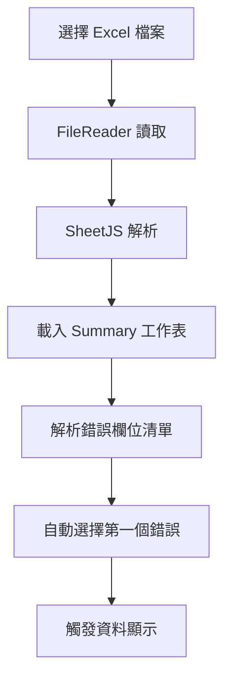
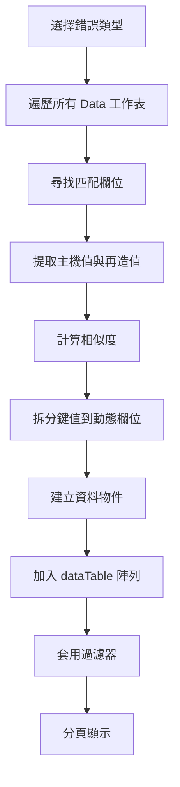
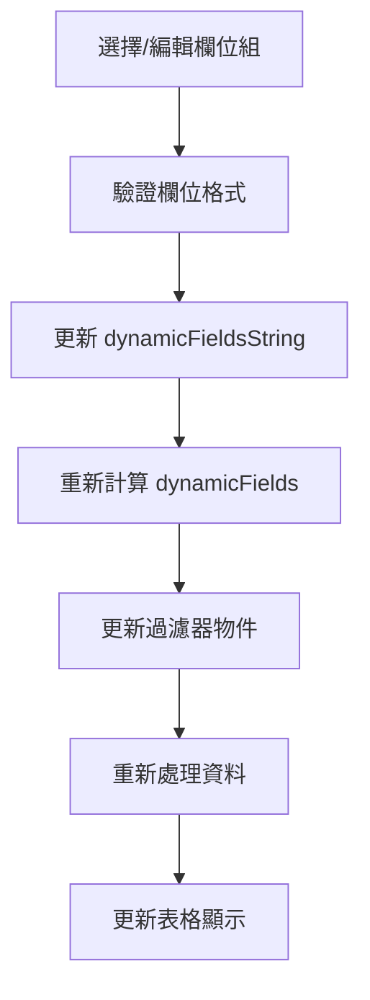

# 資料比對分析工具 - 技術文件

## 專案概述

這是一個基於 Vue 3 的前端應用程式，用於分析和比對 Excel 錯誤報表資料。工具提供動態欄位配置、多條件過濾、相似度分析等功能，採用日系簡約設計風格。

## 技術堆疊

- **前端框架**: Vue 3 (CDN)
- **UI 框架**: Bootstrap 5.1.3
- **圖示庫**: Bootstrap Icons 1.8.1
- **Excel 解析**: SheetJS (xlsx 0.16.9)
- **編碼**: UTF-8 (HTML), BIG5 (專案 COBOL/JCL 檔案)

## 核心功能

### 1. Excel 檔案處理

**檔案要求**:
- 格式: `.xlsx` 或 `.xls`
- **重要**: 檔案必須先移除密碼保護
- 必須包含 `Summary` 工作表
- 資料工作表命名規則: `Data_000000000`, `Data_000000001` ...

**資料結構**:
```
Summary 工作表 (A5 開始):
- A 欄: 錯誤欄位名稱
- B 欄: 錯誤次數

Data 工作表:
- 第 1 行: 標題列 (包含錯誤欄位名稱)
- 第 2 行起: 資料列
  - A 欄: Log Id 或鍵值 (格式: FIELD1_FIELD2_FIELD3_...)
  - 其他欄: 對應欄位值
```

### 2. 動態欄位配置系統

#### 預設欄位組

系統內建三組欄位配置：

1. **彙寄繳費通知**
   ```
   BILL_OFFICE_CODE|BILL_EQUIP_NO|BILL_YEAR_MONTH|
   BILL_CYCLE|BILL_TYPE|RECEIPT_NO
   ```

2. **彙寄地址參照檔**
   ```
   CYCLE|BILL-MONTH|BILL-OFFICE-CODE|
   BILL-EQUIP-NO|DELIVERY-NO
   ```

3. **大客戶電子檔**
   ```
   DISK-DELIVERY-NO|DISK-ACCOUNT|DISK-IDCARD-NO|
   DISK-BILL-NO|...(共17個欄位)
   ```

#### 欄位分隔符號

支援兩種分隔符號：
- **直線符號** (`|`): 主要分隔符號
- **逗號** (`,`): 替代分隔符號

#### 自訂欄位組

使用者可透過介面新增自訂欄位組：
1. 點選「新增」按鈕
2. 輸入欄位組名稱
3. 輸入欄位定義 (使用 `|` 或 `,` 分隔)
4. 系統自動驗證並儲存

### 3. 資料過濾系統

#### 基本過濾欄位

| 欄位 | 說明 | 過濾方式 |
|------|------|----------|
| 行數 | 原始資料行號 | 文字包含 |
| 主機值 | 主機端資料值 | 文字包含 |
| 相似度 | 主機值與再造值的相似度 | 數值比對 |
| 再造值 | 再造系統產生值 | 文字包含 |
| 工作表 | 來源工作表名稱 | 文字包含 |

### 7. 統計資訊顯示

#### 統計項目

系統會在上方統計資訊區域顯示以下資訊：

| 統計項目 | 說明 | 互動功能 |
|---------|------|----------|
| 錯誤欄位 | 當前選擇的錯誤欄位名稱 | - |
| 錯誤次數 | Summary 工作表中記錄的錯誤次數 | - |
| 過濾後筆數 | 套用過濾器後的資料筆數 | - |
| 多餘筆數 | 主機端多出的資料筆數 (A欄=unknown) | 點擊顯示明細 |
| 缺少筆數 | 主機端缺少的資料筆數 (A欄=miss) | 點擊顯示明細 |

#### 多餘/缺少資料檢測

**檢測規則**:
- 在 Data 工作表中，如果某一列的 A 欄值為 `unknown`，表示該列是多餘的資料
- 如果 A 欄值為 `miss`，表示該列是缺少的資料
- 資料結構：
  ```
  列 N:   A欄='unknown' 或 'miss'
  列 N+1: 欄位標題
  列 N+2: 欄位值
  ```

**明細檢視**:
- 點擊「多餘筆數」開啟多餘資料明細 Modal
- 點擊「缺少筆數」開啟缺少資料明細 Modal
- Modal 以表格形式顯示每筆資料的欄位標題與值
- 支援滾動查看多筆資料

#### 動態欄位過濾

根據當前欄位配置，自動產生對應的過濾輸入框。例如：
- `BILL_OFFICE_CODE` → 過濾 BILL_OFFICE_CODE
- `BILL_EQUIP_NO` → 過濾 BILL_EQUIP_NO

#### 相似度過濾語法

支援以下運算子：

```javascript
>90     // 大於 90%
>=90    // 大於等於 90%
<50     // 小於 50%
<=50    // 小於等於 50%
=100    // 等於 100%
<>100   // 不等於 100%
```

**範例**:
- 輸入 `>=90` 顯示相似度 ≥ 90% 的記錄
- 輸入 `<50` 顯示相似度 < 50% 的記錄

### 4. 相似度計算

#### Levenshtein Distance 演算法

使用編輯距離 (Levenshtein Distance) 計算字串相似度：

```javascript
相似度 = (1 - 編輯距離 / 較長字串長度) × 100%
```

**計算邏輯**:
1. 建立動態規劃矩陣
2. 計算最小編輯步驟數
3. 轉換為百分比相似度
4. 保留兩位小數

**特殊情況**:
- 兩個空值 → 100%
- 其中一個為空 → 0%
- null/undefined → 視為空字串

### 5. 分頁系統

#### 分頁參數

- **預設每頁筆數**: 10 筆
- **可見頁碼範圍**: 當前頁 ±5 頁
- **分頁控制**: 首頁、上一頁、下一頁、尾頁

#### 分頁導覽

```
[首頁] [上一頁] [1] [2] [3] ... [當前頁] ... [N] [下一頁] [尾頁]
```

支援直接輸入頁碼跳轉。

### 6. 明細檢視模態框

#### 顯示內容

點選「明細」按鈕時，顯示原始工作表中的三行資料：
1. **第 N 行**: 標題行 (含 Log Id)
2. **第 N+1 行**: 主機值行
3. **第 N+2 行**: 再造值行

#### 資料格式

以表格形式呈現完整欄位內容，支援橫向捲動查看超長內容。

### 7. 統計資訊顯示

## 資料流程

### 檔案載入流程



### 資料處理流程



### 欄位配置流程



## 資料結構

### errorFields 陣列

```javascript
[
  { field: "BILL_OFFICE_CODE", count: 150 },
  { field: "BILL_EQUIP_NO", count: 89 },
  // ...
]
```

### dataTable 陣列

```javascript
[
  {
    row: 2,                          // 原始行號
    mainValue: "ABC123",             // 主機值
    similarity: 95.67,               // 相似度 (%)
    derivedValue: "ABC124",          // 再造值
    BILL_OFFICE_CODE: "001",         // 動態欄位 1
    BILL_EQUIP_NO: "12345",          // 動態欄位 2
    // ... 其他動態欄位
    sheetName: "Data_000000001"      // 工作表名稱
  },
  // ...
]
```

### unknownData 陣列 (多餘資料)

```javascript
[
  {
    sheetName: "Data_000000001",     // 工作表名稱
    row: 5,                          // 行號 (A欄='unknown'的行+1)
    headers: ["欄位1", "欄位2", ...],// 欄位標題陣列
    values: ["值1", "值2", ...]      // 欄位值陣列
  },
  // ...
]
```

### missData 陣列 (缺少資料)

```javascript
[
  {
    sheetName: "Data_000000002",     // 工作表名稱
    row: 8,                          // 行號 (A欄='miss'的行+1)
    headers: ["欄位1", "欄位2", ...],// 欄位標題陣列
    values: ["值1", "值2", ...]      // 欄位值陣列
  },
  // ...
]
```

### filters 物件

```javascript
{
  row: "",                    // 行數過濾
  mainValue: "",              // 主機值過濾
  similarity: "",             // 相似度過濾 (支援運算子)
  derivedValue: "",           // 再造值過濾
  BILL_OFFICE_CODE: "",       // 動態欄位過濾 1
  BILL_EQUIP_NO: "",          // 動態欄位過濾 2
  // ... 其他動態欄位
  sheetName: ""               // 工作表過濾
}
```

## 使用者介面

### 配色方案 (日系簡約風格)

```css
主色調: #5a9bd4 (柔和藍)
輔助色: #e8f2ff (淺藍)
背景色: #f8fafe (極淺藍)
文字色: #2c3e50 (深灰藍)
邊框色: #b8d4f0 (淡藍)
強調色: #7db0d9 (中藍)
```

### 響應式斷點

- **桌面版**: > 768px
  - 顯示完整功能
  - 多欄位排列
  
- **行動版**: ≤ 768px
  - 單欄排列
  - 縮小字體
  - 簡化按鈕群組

## API 方法說明

### handleFile(event)
**功能**: 處理檔案上傳事件
**參數**: FileReader change event
**流程**:
1. 讀取檔案為 ArrayBuffer
2. 使用 SheetJS 解析
3. 載入 Summary 工作表
4. 從 A5 開始解析錯誤清單

### showData(selectedError)
**功能**: 顯示指定錯誤類型的資料
**參數**: 
- `selectedError` (string): 錯誤欄位名稱
**流程**:
1. 遍歷所有 Data_ 工作表
2. 尋找標題列中的匹配欄位
3. 提取主機值、再造值與鍵值
4. 計算相似度
5. 拆分鍵值到動態欄位
6. 建立資料陣列

### calculateSimilarity(a, b)
**功能**: 計算兩個字串的相似度
**參數**: 
- `a` (string): 字串 A
- `b` (string): 字串 B
**回傳**: 相似度百分比 (0-100)
**演算法**: Levenshtein Distance

### applyNumericFilter(target, expression)
**功能**: 套用數值比對過濾
**參數**:
- `target` (number): 目標數值
- `expression` (string): 過濾表達式 (如 ">=90")
**回傳**: boolean
**支援運算子**: `<`, `>`, `<=`, `>=`, `=`, `<>`

### showDetails(row, worksheetName)
**功能**: 顯示明細模態框
**參數**:
- `row` (object): 資料列物件
- `worksheetName` (string): 工作表名稱
**顯示**: 連續三行原始資料

### showUnknownModal()
**功能**: 顯示多餘資料明細 Modal
**流程**:
1. 取得 unknownModal 元素
2. 使用 Bootstrap Modal API 顯示
3. 顯示所有 A欄='unknown' 的資料

### showMissModal()
**功能**: 顯示缺少資料明細 Modal
**流程**:
1. 取得 missModal 元素
2. 使用 Bootstrap Modal API 顯示
3. 顯示所有 A欄='miss' 的資料

### updateFilters()
**功能**: 重建過濾器物件
**說明**: 
- 保留既有過濾值
- 根據當前動態欄位重建結構
- 初始化新欄位為空字串

### changeFieldSet()
**功能**: 切換欄位組
**流程**:
1. 套用選擇的欄位組定義
2. 更新編輯區內容
3. 重建過濾器
4. 重新處理資料
5. 顯示提示訊息

### addCustomFieldSet()
**功能**: 新增自訂欄位組
**流程**:
1. 提示輸入欄位組名稱
2. 提示輸入欄位定義
3. 驗證格式
4. 新增到 fieldSets 陣列
5. 自動切換至新欄位組

## 計算屬性說明

### dynamicFields
**功能**: 將欄位字串轉換為欄位配置陣列
**輸入**: `dynamicFieldsString`
**輸出**: 
```javascript
[
  { key: "FIELD1", label: "FIELD1", placeholder: "過濾 FIELD1" },
  { key: "FIELD2", label: "FIELD2", placeholder: "過濾 FIELD2" },
  // ...
]
```

### filteredData
**功能**: 套用所有過濾條件
**邏輯**:
1. 遍歷 dataTable
2. 檢查每個過濾器
3. 相似度使用數值比對
4. 其他欄位使用文字包含 (不區分大小寫)
5. 回傳符合的資料列

### paginatedData
**功能**: 取得當前頁資料
**計算**:
```javascript
start = (currentPage - 1) × itemsPerPage
end = start + itemsPerPage
return filteredData.slice(start, end)
```

### visiblePages
**功能**: 計算可見頁碼範圍
**邏輯**: 當前頁 ±5 頁，不超過總頁數

## 監聽器說明

### selectedError
**觸發**: 錯誤類型變更時
**動作**:
1. 重置為第一頁
2. 重新載入資料

### filters (deep watch)
**觸發**: 任何過濾器變更時
**動作**: 重置為第一頁

## 生命週期鉤子

### mounted()
**執行時機**: Vue 實例掛載後
**動作**:
1. 備份原始欄位字串
2. 初始化編輯區內容
3. 建立過濾器結構
4. 初始化 Bootstrap tooltips

## 效能最佳化建議

### 1. 大檔案處理
- 使用 Web Worker 處理 Excel 解析
- 實作虛擬捲動 (Virtual Scrolling)
- 分批載入工作表資料

### 2. 過濾優化
- 實作 debounce 延遲過濾
- 快取過濾結果
- 使用索引加速查詢

### 3. 記憶體管理
- 限制 dataTable 最大筆數
- 實作分頁資料載入
- 及時清理不使用的工作表

## 瀏覽器相容性

- **Chrome**: 90+
- **Firefox**: 88+
- **Edge**: 90+
- **Safari**: 14+

## 已知限制

1. **檔案大小**: 建議 < 10MB
2. **工作表數量**: 建議 < 100 個
3. **單一工作表列數**: 建議 < 10,000 列
4. **動態欄位數**: 建議 < 20 個

## 錯誤處理

### 常見錯誤與解決方案

| 錯誤情境 | 原因 | 解決方案 |
|---------|------|---------|
| 無法載入檔案 | 檔案有密碼保護 | 先移除 Excel 密碼 |
| Summary 不存在 | 工作表名稱錯誤 | 確認工作表名稱為 "Summary" |
| 資料未顯示 | 工作表命名不符 | 檢查 Data_ 工作表命名規則 |
| 過濾無效 | 欄位名稱不符 | 調整動態欄位配置 |

## 未來擴充方向

1. **匯出功能**: 支援匯出過濾結果為 Excel
2. **統計圖表**: 新增相似度分布圖
3. **批次處理**: 支援多檔案批次分析
4. **歷史記錄**: 儲存分析記錄
5. **自訂規則**: 支援自訂過濾規則
6. **API 整合**: 串接後端資料庫

## 開發環境設定

### 檔案結構
```
c:\project\CCBS\04.分析\產製彙寄帳單費用明細\compare\parse\
├── vueindex_new.html    # 主要 HTML 檔案
└── app_new.js           # Vue 應用程式邏輯
```

### 本機測試
1. 使用 PowerShell 啟動簡易 HTTP 伺服器
2. 開啟瀏覽器訪問 `http://localhost:8000`
3. 上傳測試用 Excel 檔案

---

**文件版本**: 1.0  
**最後更新**: 2024  
**維護者**: 池哲緯 (ropin13@cht.com.tw)
